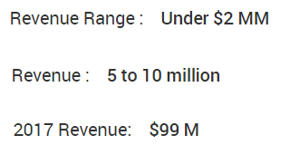
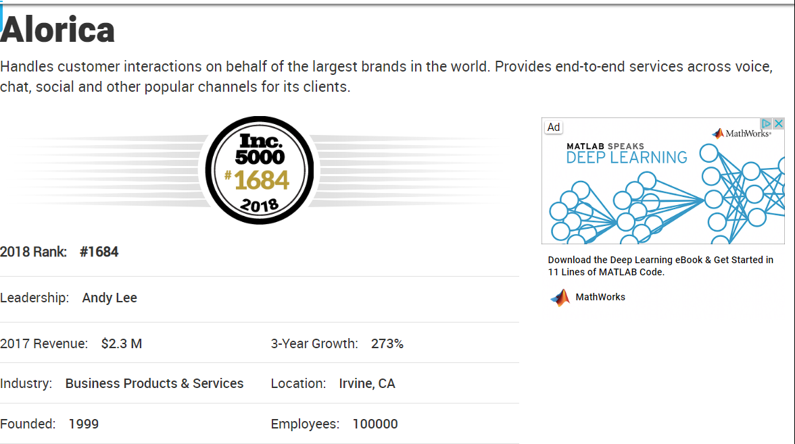

# Analyzing Inc 5000 2018 Data

This notebook performs some exploratory analysis on data extracted from https://www.inc.com/inc5000/list/2018 which is the list of Inc's 5000 fastest growing companies in 2018. The script used to collect this data is [gatherData.py](https://github.com/eila-elyas/Inc/blob/master/gatherData.py).

## Import the modules


```python
import pandas as pd
import sqlite3
import matplotlib.pyplot as plt
import seaborn as sns
import numpy as np
%matplotlib inline
```

## Reading the sqlite database 

The [gatherData.py](https://github.com/eila-elyas/Inc5000-Analysis/blob/master/gatherData.py) script exports the data to a sqlite database after collecting the data. The code below reads the data from the sqlite database.


```python
conn = sqlite3.connect("inc2018.db")
df = pd.read_sql_query("SELECT * FROM company;", conn)
```

Top 10 Rows in the Data Set


```python
df.head()
```


<div>
<style scoped>
    .dataframe tbody tr th:only-of-type {
        vertical-align: middle;
    }

    .dataframe tbody tr th {
        vertical-align: top;
    }

    .dataframe thead th {
        text-align: right;
    }
</style>
<table border="1" class="dataframe">
  <thead>
    <tr style="text-align: right;">
      <th></th>
      <th>index</th>
      <th>Rank</th>
      <th>CompanyName</th>
      <th>Leadership</th>
      <th>2017Revenue</th>
      <th>Industry</th>
      <th>Founded</th>
      <th>Growth</th>
      <th>Location</th>
      <th>Employees</th>
    </tr>
  </thead>
  <tbody>
    <tr>
      <th>0</th>
      <td>0</td>
      <td>#1</td>
      <td>SwanLeap</td>
      <td>Brad Hollister</td>
      <td>$99 M</td>
      <td>Logistics &amp; Transportation</td>
      <td>2013</td>
      <td>75,661%</td>
      <td>Madison, WI</td>
      <td>49</td>
    </tr>
    <tr>
      <th>1</th>
      <td>1</td>
      <td>#2</td>
      <td>PopSockets</td>
      <td>David Barnett</td>
      <td>$168.8 M</td>
      <td>Consumer Products &amp; Services</td>
      <td>2010</td>
      <td>71,424%</td>
      <td>Boulder, CO</td>
      <td>118</td>
    </tr>
    <tr>
      <th>2</th>
      <td>2</td>
      <td>#3</td>
      <td>Home Chef</td>
      <td>Patrick Vihtelic</td>
      <td>$255 M</td>
      <td>Food &amp; Beverage</td>
      <td>2013</td>
      <td>60,166%</td>
      <td>Chicago, IL</td>
      <td>865</td>
    </tr>
    <tr>
      <th>3</th>
      <td>3</td>
      <td>#4</td>
      <td>Velocity Global</td>
      <td>Ben Wright</td>
      <td>$49.2 M</td>
      <td>Business Products &amp; Services</td>
      <td>2013</td>
      <td>39,817%</td>
      <td>Denver, CO</td>
      <td>78</td>
    </tr>
    <tr>
      <th>4</th>
      <td>4</td>
      <td>#5</td>
      <td>DEPCOM Power</td>
      <td>Jim Lamon</td>
      <td>$219.6 M</td>
      <td>Energy</td>
      <td>2013</td>
      <td>38,963%</td>
      <td>Scottsdale, AZ</td>
      <td>104</td>
    </tr>
  </tbody>
</table>
</div>


# Munging the data set


```python
df.info()
```

    <class 'pandas.core.frame.DataFrame'>
    RangeIndex: 4999 entries, 0 to 4998
    Data columns (total 10 columns):
    index          4999 non-null int64
    Rank           4999 non-null object
    CompanyName    4999 non-null object
    Leadership     4999 non-null object
    2017Revenue    4999 non-null object
    Industry       4999 non-null object
    Founded        4999 non-null object
    Growth         4999 non-null object
    Location       4999 non-null object
    Employees      4999 non-null object
    dtypes: int64(1), object(9)
    memory usage: 390.6+ KB
    

For any attribute in which the script is not able to find the html tag it is looking for, the script outputs "couldn't find". Below I will look for all rows in which the script was not able to find an attribute.


```python
cant_find = df[df.apply(lambda row: row.astype(str).str.contains("couldn't find").any(), axis=1)]
cant_find
```


<div>
<style scoped>
    .dataframe tbody tr th:only-of-type {
        vertical-align: middle;
    }

    .dataframe tbody tr th {
        vertical-align: top;
    }

    .dataframe thead th {
        text-align: right;
    }
</style>
<table border="1" class="dataframe">
  <thead>
    <tr style="text-align: right;">
      <th></th>
      <th>index</th>
      <th>Rank</th>
      <th>CompanyName</th>
      <th>Leadership</th>
      <th>2017Revenue</th>
      <th>Industry</th>
      <th>Founded</th>
      <th>Growth</th>
      <th>Location</th>
      <th>Employees</th>
    </tr>
  </thead>
  <tbody>
    <tr>
      <th>71</th>
      <td>71</td>
      <td>couldn't find</td>
      <td>ConvertKit</td>
      <td>Nathan Barry, 27</td>
      <td>couldn't find</td>
      <td>Software</td>
      <td>2013</td>
      <td>couldn't find</td>
      <td>Boise, ID</td>
      <td>30</td>
    </tr>
    <tr>
      <th>267</th>
      <td>267</td>
      <td>couldn't find</td>
      <td>Stukent</td>
      <td>Stuart Draper</td>
      <td>couldn't find</td>
      <td>Education</td>
      <td>2013</td>
      <td>couldn't find</td>
      <td>Idaho Falls, ID</td>
      <td>48</td>
    </tr>
    <tr>
      <th>414</th>
      <td>414</td>
      <td>couldn't find</td>
      <td>Lync America</td>
      <td>Cynthia Lee</td>
      <td>couldn't find</td>
      <td>Logistics &amp; Transportation</td>
      <td>2014</td>
      <td>couldn't find</td>
      <td>Chattanooga, TN</td>
      <td>27</td>
    </tr>
    <tr>
      <th>997</th>
      <td>997</td>
      <td>couldn't find</td>
      <td>Proximity Learning Inc.</td>
      <td>Evan Erdberg</td>
      <td>couldn't find</td>
      <td>Education</td>
      <td>2009</td>
      <td>couldn't find</td>
      <td>Austin, TX</td>
      <td>150</td>
    </tr>
    <tr>
      <th>1339</th>
      <td>1339</td>
      <td>couldn't find</td>
      <td>404 Page Not Found</td>
      <td>couldn't find</td>
      <td>couldn't find</td>
      <td>couldn't find</td>
      <td>couldn't find</td>
      <td>couldn't find</td>
      <td>couldn't find</td>
      <td>couldn't find</td>
    </tr>
    <tr>
      <th>1569</th>
      <td>1569</td>
      <td>couldn't find</td>
      <td>pNeo</td>
      <td>Peter Wenham</td>
      <td>couldn't find</td>
      <td>Consumer Products &amp; Services</td>
      <td>2008</td>
      <td>couldn't find</td>
      <td>Denton, TX</td>
      <td>15</td>
    </tr>
    <tr>
      <th>1693</th>
      <td>1693</td>
      <td>couldn't find</td>
      <td>KingPay</td>
      <td>Ron Singh</td>
      <td>couldn't find</td>
      <td>Financial Services</td>
      <td>2013</td>
      <td>couldn't find</td>
      <td>London , United Kingdom</td>
      <td>50</td>
    </tr>
    <tr>
      <th>2251</th>
      <td>2251</td>
      <td>couldn't find</td>
      <td>404 Page Not Found</td>
      <td>couldn't find</td>
      <td>couldn't find</td>
      <td>couldn't find</td>
      <td>couldn't find</td>
      <td>couldn't find</td>
      <td>couldn't find</td>
      <td>couldn't find</td>
    </tr>
    <tr>
      <th>2351</th>
      <td>2351</td>
      <td>couldn't find</td>
      <td>Greenback Tax Services</td>
      <td>Carrie McKeegan</td>
      <td>couldn't find</td>
      <td>Financial Services</td>
      <td>2008</td>
      <td>couldn't find</td>
      <td>Mong Kok, Hong Kong</td>
      <td>50</td>
    </tr>
    <tr>
      <th>2485</th>
      <td>2485</td>
      <td>couldn't find</td>
      <td>EvoText</td>
      <td>Johanna Wetmore</td>
      <td>couldn't find</td>
      <td>Software</td>
      <td>2014</td>
      <td>couldn't find</td>
      <td>Burlington, MA</td>
      <td>Small (25 - 49)</td>
    </tr>
    <tr>
      <th>2582</th>
      <td>2582</td>
      <td>couldn't find</td>
      <td>ITinspired</td>
      <td>Robert Wise</td>
      <td>$147.3 M</td>
      <td>IT Services</td>
      <td>2011</td>
      <td>151%</td>
      <td>Baton Rouge, LA</td>
      <td>Micro (10 - 24)</td>
    </tr>
    <tr>
      <th>2791</th>
      <td>2791</td>
      <td>couldn't find</td>
      <td>Nationwide Transport Services, LLC</td>
      <td>Jason Foltz</td>
      <td>couldn't find</td>
      <td>Logistics &amp; Transportation</td>
      <td>2009</td>
      <td>couldn't find</td>
      <td>Fort Lauderdale, FL</td>
      <td>20</td>
    </tr>
    <tr>
      <th>2857</th>
      <td>2857</td>
      <td>couldn't find</td>
      <td>Beehive Plumbing</td>
      <td>Matthew Naylor</td>
      <td>couldn't find</td>
      <td>Construction</td>
      <td>1999</td>
      <td>couldn't find</td>
      <td>West Jordan, UT</td>
      <td>24</td>
    </tr>
    <tr>
      <th>4364</th>
      <td>4364</td>
      <td>#3854</td>
      <td>Surface Mount Technology</td>
      <td>couldn't find</td>
      <td>$14.3 M</td>
      <td>Manufacturing</td>
      <td>1997</td>
      <td>68%</td>
      <td>Appleton, WI</td>
      <td>130</td>
    </tr>
    <tr>
      <th>4660</th>
      <td>4660</td>
      <td>couldn't find</td>
      <td>404 Page Not Found</td>
      <td>couldn't find</td>
      <td>couldn't find</td>
      <td>couldn't find</td>
      <td>couldn't find</td>
      <td>couldn't find</td>
      <td>couldn't find</td>
      <td>couldn't find</td>
    </tr>
    <tr>
      <th>4971</th>
      <td>4971</td>
      <td>couldn't find</td>
      <td>Insight Global</td>
      <td>Bert Bean</td>
      <td>$1928.8 M</td>
      <td>Business Products &amp; Services</td>
      <td>2001</td>
      <td>58%</td>
      <td>Atlanta, GA</td>
      <td>2570</td>
    </tr>
  </tbody>
</table>
</div>


There are 16 company profiles in which the script was not able to extract at least one of the fields. 

The reason that the script was not able to find some of the data is because of inconsistencies in the company profiles. For example, in the image below, you can see that revenue is presented in multiple ways.


Fortunately, the script was able to capture all the data for all but 16 companies. In order to make sure the script is able to collect all the information, I would have to account for these inconsistencies. For now, I will remove these from the data set.


```python
df2 = df.drop(cant_find.index, axis = 0)
```

We need to convert some of the attributes to numeric data types. These attributes are '2017Revenue', 'Growth', 'Founded', and 'Employees'. 


```python
df2["Revenue"] = pd.to_numeric(df2["2017Revenue"].apply(lambda x: 0 if x == "couldn't find" else x[1:-2]))

df2["Founded"] = pd.to_numeric(df2["Founded"].apply(lambda x: 0 if x == "couldn't find" else x))

df2["GrowthPercent"] = pd.to_numeric(df2.Growth.apply(lambda x: 0 if x == "couldn't find" else x[:-1].replace(',', '')))
```

Some of the values in the 'Employees' attribute are provided as a range, which you can see below. In order to convert the 'Employees' attribute to numeric, I will extract the upper number provided in the range for these types of values.


```python
df2.iloc[[8]]
```


<div>
<style scoped>
    .dataframe tbody tr th:only-of-type {
        vertical-align: middle;
    }

    .dataframe tbody tr th {
        vertical-align: top;
    }

    .dataframe thead th {
        text-align: right;
    }
</style>
<table border="1" class="dataframe">
  <thead>
    <tr style="text-align: right;">
      <th></th>
      <th>index</th>
      <th>Rank</th>
      <th>CompanyName</th>
      <th>Leadership</th>
      <th>2017Revenue</th>
      <th>Industry</th>
      <th>Founded</th>
      <th>Growth</th>
      <th>Location</th>
      <th>Employees</th>
      <th>Revenue</th>
      <th>GrowthPercent</th>
    </tr>
  </thead>
  <tbody>
    <tr>
      <th>8</th>
      <td>8</td>
      <td>#8</td>
      <td>Flexport</td>
      <td>Ryan Petersen</td>
      <td>$224.7 M</td>
      <td>Logistics &amp; Transportation</td>
      <td>2013</td>
      <td>15,911%</td>
      <td>San Francisco, CA</td>
      <td>Large (250 - 499)</td>
      <td>224.7</td>
      <td>15911</td>
    </tr>
  </tbody>
</table>
</div>


To extract the upper value in the Employee counts provided as a range.


```python
def dash(s):
    if s.find("-") != -1:
        return s[s.find("- ") + 2:-1]
    else:
        return s
df2["EmployeeUpdate"] = df2.Employees.apply(dash)
df2["EmployeeUpdate"] = pd.to_numeric(df2.EmployeeUpdate.apply(lambda x: 0 if x == "couldn't find" else x))
```

## Plots

### Number of Companies per Industry


```python
#Seaborn Plot
a4_dims = (15, 6)
fig, ax = plt.subplots(figsize=a4_dims)
g = sns.countplot(df2.Industry, ax = ax, order= df2.Industry.value_counts().index)
plt.xticks(rotation=90)
plt.ylabel("Count")
plt.title("Number of Inc5000 Companies by Industry")
for p in ax.patches:
    ax.annotate(str(p.get_height()), (p.get_x() * 1.0, p.get_height() * 1.01))
```


### Number of Companies per City (top 30)


```python
ax = df2.Location.value_counts().sort_values(ascending=False).head(30).plot.bar(figsize=a4_dims, title="2018 Inc5000 Companies Per City for Top 30 Cities")
for p in ax.patches:
    ax.annotate(str(p.get_height()), (p.get_x() * 1.0, p.get_height() * 1.01))
```


### Number of Companies per State

Have to create a "State" attribute by extracting the last two characters of the "Location" attribute


```python
df2['State'] = df2["Location"].apply(lambda x: x[-2:])
```


```python
aa = df2.State.value_counts().plot.bar(figsize=a4_dims, title = "Number of 2018 Inc 5000 Companies per State")
for p in aa.patches:
    aa.annotate(str(p.get_height()), (p.get_x() * 1.0, p.get_height() + 30), rotation=90)
```


## Number of Employees vs Revenue Scatterplot


```python
a4_dims = (15, 6)
fig, ax = plt.subplots(figsize=a4_dims)
df2.plot.scatter(x = "EmployeeUpdate", y = "Revenue", ax = ax)
plt.xlabel("Number of Employees")
plt.grid()
```


There are a few companies that look like outliers. There is one in particular that stands out a lot. The point with about 100,000 employees but close to 0 revenue. Let's take a look at this one.


```python
df2[(df2.EmployeeUpdate > 90000) & (df2.EmployeeUpdate < 110000)]
```


<div>
<style scoped>
    .dataframe tbody tr th:only-of-type {
        vertical-align: middle;
    }

    .dataframe tbody tr th {
        vertical-align: top;
    }

    .dataframe thead th {
        text-align: right;
    }
</style>
<table border="1" class="dataframe">
  <thead>
    <tr style="text-align: right;">
      <th></th>
      <th>index</th>
      <th>Rank</th>
      <th>CompanyName</th>
      <th>Leadership</th>
      <th>2017Revenue</th>
      <th>Industry</th>
      <th>Founded</th>
      <th>Growth</th>
      <th>Location</th>
      <th>Employees</th>
      <th>Revenue</th>
      <th>GrowthPercent</th>
      <th>EmployeeUpdate</th>
      <th>State</th>
    </tr>
  </thead>
  <tbody>
    <tr>
      <th>1682</th>
      <td>1682</td>
      <td>#1684</td>
      <td>Alorica</td>
      <td>Andy Lee</td>
      <td>$2.3 M</td>
      <td>Business Products &amp; Services</td>
      <td>1999</td>
      <td>273%</td>
      <td>Irvine, CA</td>
      <td>100000</td>
      <td>2.3</td>
      <td>273</td>
      <td>100000</td>
      <td>CA</td>
    </tr>
  </tbody>
</table>
</div>


Alcoria has 100,000 employees but only $2.3M in revenue. This doesn't seem right. However, as you can see in the image below, that is exactly what is provided in their Inc.com profile.



### Violinplot of Revenue Per Employee Segmented by Industry

Creating a new 'Revenue Per Employee' attribute. First, there are several companies that have 0 employees in their Inc.com profile.


```python
df2[df2.EmployeeUpdate == 0]
```


<div>
<style scoped>
    .dataframe tbody tr th:only-of-type {
        vertical-align: middle;
    }

    .dataframe tbody tr th {
        vertical-align: top;
    }

    .dataframe thead th {
        text-align: right;
    }
</style>
<table border="1" class="dataframe">
  <thead>
    <tr style="text-align: right;">
      <th></th>
      <th>index</th>
      <th>Rank</th>
      <th>CompanyName</th>
      <th>Leadership</th>
      <th>2017Revenue</th>
      <th>Industry</th>
      <th>Founded</th>
      <th>Growth</th>
      <th>Location</th>
      <th>Employees</th>
      <th>Revenue</th>
      <th>GrowthPercent</th>
      <th>EmployeeUpdate</th>
      <th>State</th>
    </tr>
  </thead>
  <tbody>
    <tr>
      <th>1973</th>
      <td>1973</td>
      <td>#1975</td>
      <td>MJ Freeway</td>
      <td>Amy Poinsett</td>
      <td>$8.1 M</td>
      <td>Software</td>
      <td>2010</td>
      <td>226%</td>
      <td>Denver, CO</td>
      <td>0</td>
      <td>8.1</td>
      <td>226</td>
      <td>0</td>
      <td>CO</td>
    </tr>
    <tr>
      <th>2267</th>
      <td>2267</td>
      <td>#2270</td>
      <td>Playags</td>
      <td>David Lopez</td>
      <td>$212 M</td>
      <td>Business Products &amp; Services</td>
      <td>2005</td>
      <td>194%</td>
      <td>Las Vegas, NV</td>
      <td>0</td>
      <td>212.0</td>
      <td>194</td>
      <td>0</td>
      <td>NV</td>
    </tr>
    <tr>
      <th>2899</th>
      <td>2899</td>
      <td>#2902</td>
      <td>Grand Power Systems</td>
      <td>Stephen Paul</td>
      <td>$29.5 M</td>
      <td>Energy</td>
      <td>1948</td>
      <td>141%</td>
      <td>Grand Haven, MI</td>
      <td>0</td>
      <td>29.5</td>
      <td>141</td>
      <td>0</td>
      <td>MI</td>
    </tr>
    <tr>
      <th>3158</th>
      <td>3158</td>
      <td>#3161</td>
      <td>BayCom</td>
      <td>George Guarini</td>
      <td>$44.3 M</td>
      <td>Financial Services</td>
      <td>2004</td>
      <td>125%</td>
      <td>Walnut Creek, CA</td>
      <td>0</td>
      <td>44.3</td>
      <td>125</td>
      <td>0</td>
      <td>CA</td>
    </tr>
    <tr>
      <th>3434</th>
      <td>3434</td>
      <td>#3437</td>
      <td>Peddle</td>
      <td>Tim Yarosh</td>
      <td>$65.6 M</td>
      <td>Consumer Products &amp; Services</td>
      <td>2011</td>
      <td>111%</td>
      <td>Austin, TX</td>
      <td>0</td>
      <td>65.6</td>
      <td>111</td>
      <td>0</td>
      <td>TX</td>
    </tr>
    <tr>
      <th>3435</th>
      <td>3435</td>
      <td>#3438</td>
      <td>E-file.com</td>
      <td>Aaron Rosenthal and Robert Reynard</td>
      <td>$5.1 M</td>
      <td>Consumer Products &amp; Services</td>
      <td>2011</td>
      <td>111%</td>
      <td>Ponte Vedra, FL</td>
      <td>0</td>
      <td>5.1</td>
      <td>111</td>
      <td>0</td>
      <td>FL</td>
    </tr>
    <tr>
      <th>4066</th>
      <td>4066</td>
      <td>#4069</td>
      <td>Bridgewater Bancshares</td>
      <td>Jerry Baack</td>
      <td>$52.5 M</td>
      <td>Financial Services</td>
      <td>2005</td>
      <td>86%</td>
      <td>Bloomington, MN</td>
      <td>0</td>
      <td>52.5</td>
      <td>86</td>
      <td>0</td>
      <td>MN</td>
    </tr>
    <tr>
      <th>4776</th>
      <td>4776</td>
      <td>#4778</td>
      <td>Ellison Bakery</td>
      <td>Todd Wallin</td>
      <td>$29.9 M</td>
      <td>Food &amp; Beverage</td>
      <td>1945</td>
      <td>64%</td>
      <td>Ft. Wayne, IN</td>
      <td>0</td>
      <td>29.9</td>
      <td>64</td>
      <td>0</td>
      <td>IN</td>
    </tr>
    <tr>
      <th>4822</th>
      <td>4822</td>
      <td>#4824</td>
      <td>Quality Aluminum Products</td>
      <td>Bob Clark</td>
      <td>$45 M</td>
      <td>Manufacturing</td>
      <td>1990</td>
      <td>63%</td>
      <td>Hastings, MI</td>
      <td>0</td>
      <td>45.0</td>
      <td>63</td>
      <td>0</td>
      <td>MI</td>
    </tr>
    <tr>
      <th>4951</th>
      <td>4951</td>
      <td>#4953</td>
      <td>Custom Profile</td>
      <td>John Boeschenstein</td>
      <td>$48.3 M</td>
      <td>Manufacturing</td>
      <td>1992</td>
      <td>59%</td>
      <td>Grand Rapids, MI</td>
      <td>0</td>
      <td>48.3</td>
      <td>59</td>
      <td>0</td>
      <td>MI</td>
    </tr>
    <tr>
      <th>4977</th>
      <td>4977</td>
      <td>#4979</td>
      <td>Mediassociates</td>
      <td>Scott Brunjes</td>
      <td>$11.5 M</td>
      <td>Advertising &amp; Marketing</td>
      <td>1996</td>
      <td>58%</td>
      <td>Sandy Hook, CT</td>
      <td>0</td>
      <td>11.5</td>
      <td>58</td>
      <td>0</td>
      <td>CT</td>
    </tr>
  </tbody>
</table>
</div>


```python
df3 = df2[df2.EmployeeUpdate > 0]
```

And now I will create the "Revenue Per Employee" attribute and create the violin plot.


```python
df3['RevenuePerEmployee'] = df3.Revenue/df3.EmployeeUpdate
```

    C:\Users\Eila\.virtualenvs\Inc5000Git-0brB-nxP\lib\site-packages\ipykernel_launcher.py:1: SettingWithCopyWarning: 
    A value is trying to be set on a copy of a slice from a DataFrame.
    Try using .loc[row_indexer,col_indexer] = value instead
    
    See the caveats in the documentation: http://pandas.pydata.org/pandas-docs/stable/indexing.html#indexing-view-versus-copy
      """Entry point for launching an IPython kernel.
    


```python
a4_dims = (15, 6)
fig, ax = plt.subplots(figsize=a4_dims)
sns.violinplot(data = df3, ax = ax, x = "Industry", y = "RevenuePerEmployee")
plt.xticks(rotation=90)
```


    (array([ 0,  1,  2,  3,  4,  5,  6,  7,  8,  9, 10, 11, 12, 13, 14, 15, 16,
            17, 18, 19, 20, 21, 22, 23, 24, 25, 26]),
     <a list of 27 Text xticklabel objects>)


## Tables

### Revenue Statistics Segmented by Industry


```python
df3[df3.Revenue > 0].groupby("Industry").agg(['mean', 'std', 'count', 'max', 'min', 'sum']).Revenue.sort_values(by="sum", ascending = False)
```


<div>
<style scoped>
    .dataframe tbody tr th:only-of-type {
        vertical-align: middle;
    }

    .dataframe tbody tr th {
        vertical-align: top;
    }

    .dataframe thead th {
        text-align: right;
    }
</style>
<table border="1" class="dataframe">
  <thead>
    <tr style="text-align: right;">
      <th></th>
      <th>mean</th>
      <th>std</th>
      <th>count</th>
      <th>max</th>
      <th>min</th>
      <th>sum</th>
    </tr>
    <tr>
      <th>Industry</th>
      <th></th>
      <th></th>
      <th></th>
      <th></th>
      <th></th>
      <th></th>
    </tr>
  </thead>
  <tbody>
    <tr>
      <th>Health</th>
      <td>96.040533</td>
      <td>856.745368</td>
      <td>375</td>
      <td>16433.2</td>
      <td>2.0</td>
      <td>36015.2</td>
    </tr>
    <tr>
      <th>Financial Services</th>
      <td>60.864629</td>
      <td>148.527287</td>
      <td>229</td>
      <td>1154.7</td>
      <td>2.1</td>
      <td>13938.0</td>
    </tr>
    <tr>
      <th>Consumer Products &amp; Services</th>
      <td>48.654286</td>
      <td>254.423498</td>
      <td>280</td>
      <td>3267.1</td>
      <td>2.0</td>
      <td>13623.2</td>
    </tr>
    <tr>
      <th>Construction</th>
      <td>37.340533</td>
      <td>89.558344</td>
      <td>338</td>
      <td>748.7</td>
      <td>2.0</td>
      <td>12621.1</td>
    </tr>
    <tr>
      <th>Business Products &amp; Services</th>
      <td>26.239103</td>
      <td>75.395264</td>
      <td>468</td>
      <td>1007.1</td>
      <td>2.0</td>
      <td>12279.9</td>
    </tr>
    <tr>
      <th>Logistics &amp; Transportation</th>
      <td>74.874214</td>
      <td>281.502587</td>
      <td>159</td>
      <td>2950.8</td>
      <td>2.2</td>
      <td>11905.0</td>
    </tr>
    <tr>
      <th>Government Services</th>
      <td>46.492578</td>
      <td>261.157465</td>
      <td>256</td>
      <td>4107.5</td>
      <td>2.0</td>
      <td>11902.1</td>
    </tr>
    <tr>
      <th>Real Estate</th>
      <td>39.348305</td>
      <td>98.591859</td>
      <td>236</td>
      <td>900.5</td>
      <td>2.0</td>
      <td>9286.2</td>
    </tr>
    <tr>
      <th>Retail</th>
      <td>43.652660</td>
      <td>138.322317</td>
      <td>188</td>
      <td>1460.4</td>
      <td>2.0</td>
      <td>8206.7</td>
    </tr>
    <tr>
      <th>Security</th>
      <td>114.383582</td>
      <td>650.593545</td>
      <td>67</td>
      <td>5301.5</td>
      <td>2.0</td>
      <td>7663.7</td>
    </tr>
    <tr>
      <th>Advertising &amp; Marketing</th>
      <td>15.858368</td>
      <td>29.010088</td>
      <td>478</td>
      <td>317.0</td>
      <td>2.0</td>
      <td>7580.3</td>
    </tr>
    <tr>
      <th>Software</th>
      <td>16.920957</td>
      <td>29.171654</td>
      <td>439</td>
      <td>283.6</td>
      <td>2.0</td>
      <td>7428.3</td>
    </tr>
    <tr>
      <th>Food &amp; Beverage</th>
      <td>49.118000</td>
      <td>118.893832</td>
      <td>150</td>
      <td>974.8</td>
      <td>2.0</td>
      <td>7367.7</td>
    </tr>
    <tr>
      <th>Human Resources</th>
      <td>48.632667</td>
      <td>182.076032</td>
      <td>150</td>
      <td>2110.2</td>
      <td>2.1</td>
      <td>7294.9</td>
    </tr>
    <tr>
      <th>Insurance</th>
      <td>72.028767</td>
      <td>168.063131</td>
      <td>73</td>
      <td>1039.9</td>
      <td>2.0</td>
      <td>5258.1</td>
    </tr>
    <tr>
      <th>Energy</th>
      <td>53.985106</td>
      <td>161.320671</td>
      <td>94</td>
      <td>1401.3</td>
      <td>2.2</td>
      <td>5074.6</td>
    </tr>
    <tr>
      <th>IT Management</th>
      <td>19.249597</td>
      <td>37.055373</td>
      <td>248</td>
      <td>330.6</td>
      <td>2.0</td>
      <td>4773.9</td>
    </tr>
    <tr>
      <th>Media</th>
      <td>83.958182</td>
      <td>475.331867</td>
      <td>55</td>
      <td>3541.2</td>
      <td>2.0</td>
      <td>4617.7</td>
    </tr>
    <tr>
      <th>Manufacturing</th>
      <td>28.253642</td>
      <td>77.047786</td>
      <td>151</td>
      <td>793.0</td>
      <td>2.0</td>
      <td>4266.3</td>
    </tr>
    <tr>
      <th>IT System Development</th>
      <td>20.500000</td>
      <td>37.661812</td>
      <td>148</td>
      <td>364.5</td>
      <td>2.0</td>
      <td>3034.0</td>
    </tr>
    <tr>
      <th>Telecommunications</th>
      <td>34.511392</td>
      <td>97.175426</td>
      <td>79</td>
      <td>811.2</td>
      <td>2.0</td>
      <td>2726.4</td>
    </tr>
    <tr>
      <th>Travel &amp; Hospitality</th>
      <td>24.092537</td>
      <td>42.271092</td>
      <td>67</td>
      <td>188.3</td>
      <td>2.0</td>
      <td>1614.2</td>
    </tr>
    <tr>
      <th>Engineering</th>
      <td>19.117857</td>
      <td>32.019701</td>
      <td>84</td>
      <td>246.8</td>
      <td>2.0</td>
      <td>1605.9</td>
    </tr>
    <tr>
      <th>Education</th>
      <td>16.222093</td>
      <td>28.866970</td>
      <td>86</td>
      <td>187.0</td>
      <td>2.0</td>
      <td>1395.1</td>
    </tr>
    <tr>
      <th>Computer Hardware</th>
      <td>30.523684</td>
      <td>37.442110</td>
      <td>38</td>
      <td>196.7</td>
      <td>2.2</td>
      <td>1159.9</td>
    </tr>
    <tr>
      <th>Environmental Services</th>
      <td>19.529412</td>
      <td>30.956035</td>
      <td>34</td>
      <td>129.4</td>
      <td>2.0</td>
      <td>664.0</td>
    </tr>
    <tr>
      <th>IT Services</th>
      <td>117.450000</td>
      <td>159.594001</td>
      <td>2</td>
      <td>230.3</td>
      <td>4.6</td>
      <td>234.9</td>
    </tr>
  </tbody>
</table>
</div>


### Growth Statistics Segmented by Industry (%)


```python
df3[df3.GrowthPercent > 0].groupby('Industry').agg(['mean', 'std', 'count', 'max', 'min', 'sum'])['GrowthPercent'].sort_values(by='mean', ascending=False)
```


<div>
<style scoped>
    .dataframe tbody tr th:only-of-type {
        vertical-align: middle;
    }

    .dataframe tbody tr th {
        vertical-align: top;
    }

    .dataframe thead th {
        text-align: right;
    }
</style>
<table border="1" class="dataframe">
  <thead>
    <tr style="text-align: right;">
      <th></th>
      <th>mean</th>
      <th>std</th>
      <th>count</th>
      <th>max</th>
      <th>min</th>
      <th>sum</th>
    </tr>
    <tr>
      <th>Industry</th>
      <th></th>
      <th></th>
      <th></th>
      <th></th>
      <th></th>
      <th></th>
    </tr>
  </thead>
  <tbody>
    <tr>
      <th>Logistics &amp; Transportation</th>
      <td>1168.509434</td>
      <td>6336.839820</td>
      <td>159</td>
      <td>75661</td>
      <td>57</td>
      <td>185793</td>
    </tr>
    <tr>
      <th>Energy</th>
      <td>1078.882979</td>
      <td>4081.815956</td>
      <td>94</td>
      <td>38963</td>
      <td>57</td>
      <td>101415</td>
    </tr>
    <tr>
      <th>Computer Hardware</th>
      <td>993.815789</td>
      <td>3285.066233</td>
      <td>38</td>
      <td>19718</td>
      <td>57</td>
      <td>37765</td>
    </tr>
    <tr>
      <th>Food &amp; Beverage</th>
      <td>877.320000</td>
      <td>4964.107295</td>
      <td>150</td>
      <td>60166</td>
      <td>58</td>
      <td>131598</td>
    </tr>
    <tr>
      <th>Consumer Products &amp; Services</th>
      <td>810.189286</td>
      <td>4367.982944</td>
      <td>280</td>
      <td>71424</td>
      <td>58</td>
      <td>226853</td>
    </tr>
    <tr>
      <th>Retail</th>
      <td>738.882979</td>
      <td>1497.290007</td>
      <td>188</td>
      <td>10924</td>
      <td>58</td>
      <td>138910</td>
    </tr>
    <tr>
      <th>Media</th>
      <td>706.781818</td>
      <td>986.464519</td>
      <td>55</td>
      <td>5686</td>
      <td>59</td>
      <td>38873</td>
    </tr>
    <tr>
      <th>Government Services</th>
      <td>659.203125</td>
      <td>1510.899609</td>
      <td>256</td>
      <td>14476</td>
      <td>57</td>
      <td>168756</td>
    </tr>
    <tr>
      <th>Security</th>
      <td>628.283582</td>
      <td>1910.105842</td>
      <td>67</td>
      <td>14032</td>
      <td>60</td>
      <td>42095</td>
    </tr>
    <tr>
      <th>Software</th>
      <td>532.669704</td>
      <td>1038.203303</td>
      <td>439</td>
      <td>12501</td>
      <td>57</td>
      <td>233842</td>
    </tr>
    <tr>
      <th>Real Estate</th>
      <td>532.457627</td>
      <td>1444.900751</td>
      <td>236</td>
      <td>14822</td>
      <td>60</td>
      <td>125660</td>
    </tr>
    <tr>
      <th>Health</th>
      <td>524.872000</td>
      <td>1432.263503</td>
      <td>375</td>
      <td>16427</td>
      <td>57</td>
      <td>196827</td>
    </tr>
    <tr>
      <th>Advertising &amp; Marketing</th>
      <td>500.899582</td>
      <td>1109.274987</td>
      <td>478</td>
      <td>13135</td>
      <td>58</td>
      <td>239430</td>
    </tr>
    <tr>
      <th>Business Products &amp; Services</th>
      <td>460.369658</td>
      <td>1992.530734</td>
      <td>468</td>
      <td>39817</td>
      <td>57</td>
      <td>215453</td>
    </tr>
    <tr>
      <th>Human Resources</th>
      <td>458.300000</td>
      <td>1179.958780</td>
      <td>150</td>
      <td>10057</td>
      <td>58</td>
      <td>68745</td>
    </tr>
    <tr>
      <th>Environmental Services</th>
      <td>444.058824</td>
      <td>803.685674</td>
      <td>34</td>
      <td>3621</td>
      <td>64</td>
      <td>15098</td>
    </tr>
    <tr>
      <th>Insurance</th>
      <td>425.821918</td>
      <td>750.473653</td>
      <td>73</td>
      <td>4206</td>
      <td>60</td>
      <td>31085</td>
    </tr>
    <tr>
      <th>Financial Services</th>
      <td>424.449782</td>
      <td>785.639723</td>
      <td>229</td>
      <td>7340</td>
      <td>58</td>
      <td>97199</td>
    </tr>
    <tr>
      <th>Education</th>
      <td>407.825581</td>
      <td>668.886646</td>
      <td>86</td>
      <td>4409</td>
      <td>58</td>
      <td>35073</td>
    </tr>
    <tr>
      <th>IT Services</th>
      <td>374.500000</td>
      <td>347.189430</td>
      <td>2</td>
      <td>620</td>
      <td>129</td>
      <td>749</td>
    </tr>
    <tr>
      <th>Travel &amp; Hospitality</th>
      <td>367.194030</td>
      <td>626.599099</td>
      <td>67</td>
      <td>4242</td>
      <td>61</td>
      <td>24602</td>
    </tr>
    <tr>
      <th>IT System Development</th>
      <td>342.250000</td>
      <td>506.216469</td>
      <td>148</td>
      <td>4244</td>
      <td>58</td>
      <td>50653</td>
    </tr>
    <tr>
      <th>Construction</th>
      <td>327.230769</td>
      <td>647.530387</td>
      <td>338</td>
      <td>7382</td>
      <td>57</td>
      <td>110604</td>
    </tr>
    <tr>
      <th>IT Management</th>
      <td>310.387097</td>
      <td>526.825712</td>
      <td>248</td>
      <td>4475</td>
      <td>59</td>
      <td>76976</td>
    </tr>
    <tr>
      <th>Engineering</th>
      <td>291.226190</td>
      <td>496.435593</td>
      <td>84</td>
      <td>3422</td>
      <td>57</td>
      <td>24463</td>
    </tr>
    <tr>
      <th>Telecommunications</th>
      <td>284.202532</td>
      <td>445.612036</td>
      <td>79</td>
      <td>3049</td>
      <td>59</td>
      <td>22452</td>
    </tr>
    <tr>
      <th>Manufacturing</th>
      <td>265.284768</td>
      <td>388.211547</td>
      <td>151</td>
      <td>3152</td>
      <td>59</td>
      <td>40058</td>
    </tr>
  </tbody>
</table>
</div>


